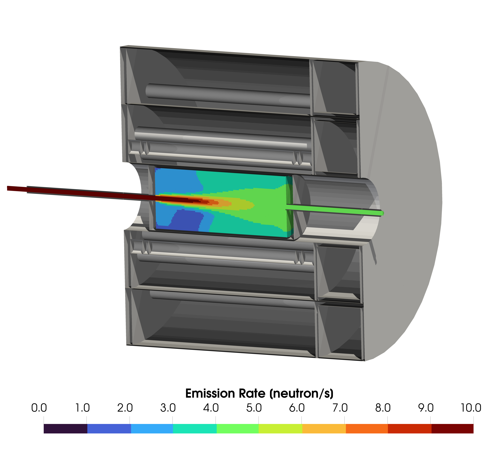
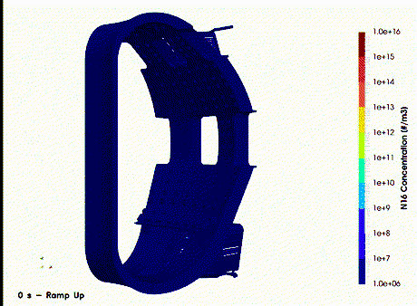

# FLUNED-Repository

This repository includes FLUNED, a CFD-based tool for the simulation of activated water in fusion installations.

More detail on the usage, installation and testing is provided in the documentation pages: [FLUNED Documentation](https://marco-de-pietri.github.io/FLUNED-repository/index.html)

For additional information or contact: mdptr@mit.edu

## FLUNED Overview

FLUNED is a mesh-based tool for the simulation of the transport within water of radio-isotopes generated by a neutron source.

The tool takes as input the irradiation properties and a finished hydro-dynamic simulation performed with the code ANSYS FLUENT or OpenFOAM and creates a passive scalar simulation of the radio-isotope concentration.


<p align="center">
  
  
</p>


## Quickstart - Installation

The recommended way to install FLUNED is to use the installation script present in the _FLUNED-Repository/installation-script/_ folder. The tools needs to run in a linux environment, the software requirements are OpenFOAM v12 and the packages listed either in the toml file or in the installation script.

The simplest way is to download the script and run it with the following commands:

1. Download
```
wget https://raw.githubusercontent.com/marco-de-pietri/FLUNED-repository/refs/heads/master/installation-script/fluned-repo-install.sh
```

2. Make it executable
```
chmod +x fluned-repo-install.sh
```

3. Install it
```
./fluned-repo-install.sh
```

4. Restart shell or source the rc configuration file 
```
source ~/.bashrc
```

## Quickstart - usage

The pre/post-processor scripts and the solver are designed to simplify the user simulation process. From the command line in the folder where the Ansys - FLUENT or OpenFOAM files are located the following workflow is recommended.

 1.	 Generate a FLUNED input template:

 ```
 fluned -t
 ```

 2.	 Modify the input_template file with the appropriate parameters. The file will contain the default values together with the available options.

 3.	 Launch the FLUNED pre-processor:

 ```
 fluned -i input-file
 ```

This will create a folder named as the FLUNED case reported in the input file. The created simulation files follow the OpenFOAM structure, therefore some additional tweaking in the simulation parameters can be done if the user has some previous knowledge of the OpenFOAM code. Thanks to the modularity of the OpenFOAM classes, FLUNED simulations can be natively run in parallel using the appropriate OpenFOAM commands.

4.	In the FLUNED case folder launch the solver by running:

```
FLUNED-solver
```

5.	Once the simulation is finished, the post-processor can be launched in the simulation folder by simply running:

```
fluned-post
```

## Citing

When citing FLUNED, please consider the following publication:

De Pietri, M., Alguacil, J., Rodríguez, E. and Juárez, R., 2023. 
Development and validation in water of FLUNED, an open-source tool for fluid activation calculations. 
_Computer Physics Communications_, 291, p.108807. [https://doi.org/10.1016/j.cpc.2023.108807]


## LICENSE
All the code present in the FLUNED-Repository is open-source software licensed under the [GNU GPLv3](./LICENSE) license.
