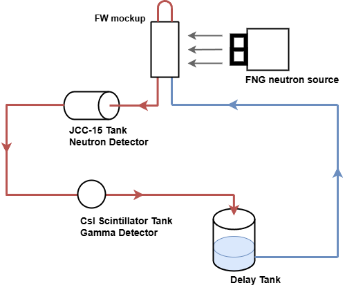
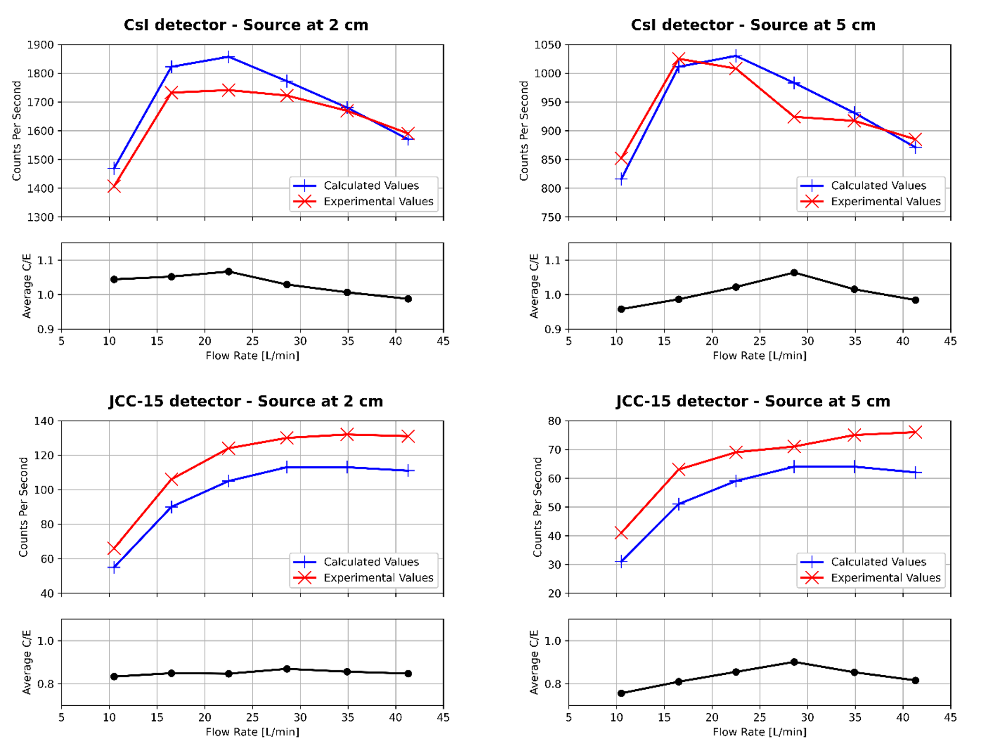

==========
Validation
==========

The verification and validation process has been described in detail in the initial FLUNED paper (`De Pietri et al., 2023 <https://doi.org/10.1016/j.cpc.2023.108807>`_).

While the verification is based on the reproduction of cases solvable with analytical methods, the validation was done through the reproduction of an experimental benchmark.
The chosen experiment is the water activation experiment run at the Frascati Neutron Generator (FNG) in 2019, which included measurements of neutron and photon emissions from the neutron-irradiated water 
(`Angelone et al., 2020 <https://doi.org/10.1016/j.fusengdes.2020.111998>`_; `Nobs et al., 2020 <https://doi.org/10.1016/j.fusengdes.2020.111743>`_).
The FNG neutron source emits 14 MeV neutrons, therefore the validation exercise is relevant for the application of the code in activated water studies of nuclear fusion installations. 

For the validation benchmark, the circuit scheme and the graphs summarizing the results are shown in the Figures below.

   FNG-2019 Water Activation experimental Circuit.

   FLUNED simulation results against the FNG-2019 Water Activation experimental measurements.

